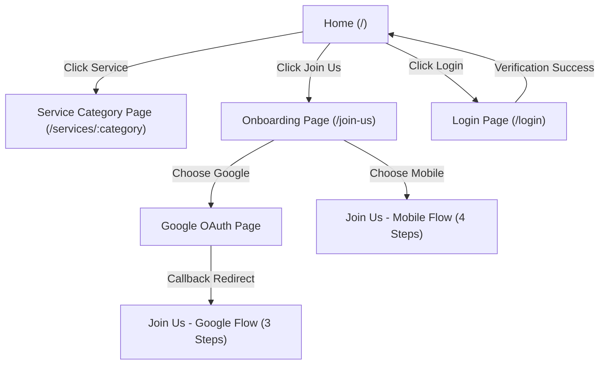

# FEAG - Empowering Ambitious Generation

This is a [Next.js](https://nextjs.org) web application that serves as the frontend client portal for the FEAG platform.

## 🚀 Getting Started

First, install the dependencies and run the development server:

```bash
npm install
npm run dev
```

Open [http://localhost:3000](http://localhost:3000) with your browser to see the result.

---

## 🗺️ Website Flow & Architecture



### 1. 🏠 Landing / Homepage (`/`)
* **Visual Components:**
  * **Loader:** Initial animated screen (`Loader.tsx`) before layout mounts.
  * **Hero:** Introduces the platform to users.
  * **Services Grid:** Dynamic cards displaying primary category offerings (Photographers, Videographers, Singers). Clicking cards routes users to the corresponding service listing directory (`/services/[category]`).
  * **Process Map:** 3-step process guide (Search $\rightarrow$ Book $\rightarrow$ Secure).
  * **Testimonials:** Review slider showing customer success stories.
* **Global Navigation Header (`Navbar.tsx`):**
  * Logo linking back to homepage.
  * Links to jump-scroll sections (`Services`, `History`, `Support`).
  * **Wishlist Link:** Renders a bookmark emoji `🔖` with a dynamic primary-colored circular badge showing active wishlist items count (currently static `3`).
  * **Login Button:** Routes to the sign-in page.
  * **Join Us Button:** Routes to the onboarding portal.

### 2. 📋 Onboarding portal (`/join-us`)
* **Form Logic:** Uses `react-hook-form` to track onboarding inputs, which are synced with Redux and `localStorage` to resume state on page refreshes.
* **Conditional Wizard Paths:**

#### Flow A: Standard Mobile Registration (4 Steps)
1. **Mobile Verification:** Users input their mobile number and resolve a Cloudflare Turnstile challenge. Standard test OTP `123456` is verified.
2. **Personal Information:** Requests **Full Name** and **Email Address**.
3. **Professional Category:** User selects their profile role (`creator` or `customer`) and professional categories (for creators).
4. **Location Details:** Validates and stores the user's **Pincode** and **City Location**.

#### Flow B: Google OAuth Authentication (3 Steps)
1. **Google Redirection:** User clicks *Continue with Google*. Any currently entered phone number is preserved in the OAuth `state` parameter, and the browser redirects to `/api/auth/google`.
2. **OAuth Callback:** Google callback exchanges the authorization code, fetches user metadata (name & email), and redirects the browser back to `/join-us?google_signup=success&name=...&email=...&mobile=...`.
3. **Optimized Wizard (No Redundant Steps):** On mount, the query parameters are parsed and cleared from history. The flow adjusts to 3 steps, merging **Mobile Verification** and **Full Name** (prefilled, editable) into Step 1, completely omitting the separate personal info step.

### 3. 🔐 User Authentication (`/login`)
* **Validation:** Before allowing authentication, the login logic checks `localStorage` registration records to ensure the user has completed the onboarding flow first.
* **Sign-in Methods:**
  * **Mobile OTP Login:** Requests mobile number, verifies registration, runs Turnstile challenge, and verifies simulated OTP `123456`.
  * **Google Login:** Verifies the Google email profile against registration records before logging the user in.
* **Redirect:** Instantly redirects users to the home dashboard `/` upon successful login.

### 4. 🔍 Service Listings & Search (`/services/[category]`)
* **Data Source:** Pulls from static mock database containing professional records (`src/lib/data/professionals.ts`).
* **Filtering System:**
  * **Search:** Performs sub-string username matching.
  * **Location:** Populates options dynamically based on available professionals in the active category.
  * **Price Range:** Categorizes hourly rates (e.g. Under 2000, 2000-4000, Above 4000).
  * **Rating, Experience, and Availability:** Refines matches based on professional profiles.
* **Sorting Capabilities:** Groups by Recommended, Price (Low to High / High to Low), Highest Rated, and Most Popular.
* **Grid Presentation:** Features premium category search header and a card grid displaying 4 items per page with custom pagination indicators.

---

## 💾 State Management & Store

* **Store Setup:** Located in `src/lib/store/store.ts` configuring a Redux toolkit store.
* **Onboarding Slice (`onboardingSlice.ts`):**
  * Tracks onboarding data state: `mobile`, `otp`, `name`, `email`, `role`, `category`, `pincode`, `location`, `isSubmitted`, and `signUpMethod`.
  * Actions: `updateOnboardingData`, `setSignUpMethod`, `submitOnboarding`, and `clearOnboardingData`.
  * Automatically synchronizes changes with `localStorage` (`feag_onboarding_data`) to prevent data loss on page refreshes.

